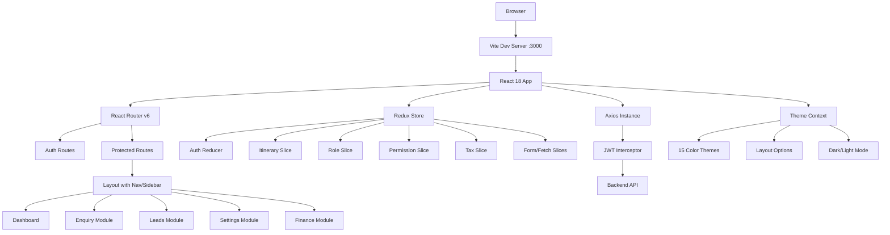

<p align="center">
  
</p>

<h1 align="center">TIC Tours — Admin Dashboard</h1>

<p align="center">
  <strong>An enterprise-grade tour & travel management admin panel for managing enquiries, quotations, itineraries, leads, hotels, payments, and more.</strong>
</p>

<p align="center">
  
  
  
  
  
  
</p>

---

## 📋 Table of Contents

- [Overview](#-overview)
- [Features](#-features)
- [Tech Stack](#-tech-stack)
- [Project Structure](#-project-structure)
- [Getting Started](#-getting-started)
- [Environment Variables](#-environment-variables)
- [Available Scripts](#-available-scripts)
- [API Endpoints](#-api-endpoints)
- [Architecture](#-architecture)
- [Theming & Customization](#-theming--customization)
- [Role-Based Access Control](#-role-based-access-control)
- [Screenshots](#-screenshots)
- [Contributing](#-contributing)

---

## 🌐 Overview

**TIC Tours Admin Dashboard** is a full-featured, responsive admin panel built for the travel and tourism industry. It enables travel agencies to manage their entire business workflow from a single interface — including customer enquiries, tour package quotations, itinerary planning, lead tracking, hotel management, supplier payments, and more.

The application is built with **React 18** and **Vite** for lightning-fast development, using **Redux** for state management and connecting to a RESTful backend API via **Axios** with JWT-based authentication.

---

## ✨ Features

### 📊 Dashboard & Analytics
- Interactive dashboard with real-time statistics and KPIs
- Charts and graphs powered by **Recharts** and **ApexCharts**
- Enquiry sliders, hotel sliders, and review sliders
- Quotation inbox with quick-access notifications
- Dark mode dashboard variant

### 📝 Enquiry Management
- Full enquiry lifecycle management (Create → Quotation → Follow-up → Payment → Closure)
- **Quotation Builder** — Build detailed tour package quotations with:
  - Hotel insertions with room & meal plan selection
  - Activity/excursion scheduling
  - Transfer/transport arrangements
  - Day-wise itinerary planning
- **Itinerary Preview** — Print-ready itinerary generation
- **Share Modal** — Share quotations via email
- Payment tracking (customer payments & supplier payments)
- Mail-to-supplier communication
- Follow-up scheduling and tracking

### 🎯 Leads CRM
- Lead capture and management
- Lead source tracking
- Priority-based classification
- Advanced search and filtering (77KB feature-rich component)

### 🏨 Hotel Management
- Hotel listing with CRUD operations
- Property categories and property types
- Room types and room amenities management
- Hotel amenities configuration
- Meal plan management
- Market type settings

### ⚙️ Comprehensive Settings
| Module | Description |
|--------|-------------|
| **Destination Management** | Destinations and sub-destinations hierarchy |
| **User Management** | Users, roles, and granular permissions |
| **Company Settings** | Company profile, currency, and custom fields |
| **Activity Management** | Tours/activities with status tracking |
| **Transfer Management** | Transport/transfer services configuration |
| **Supplier Management** | Supplier directory and relationships |
| **Tax Configuration** | Tax rules and calculations |
| **Currency Management** | Multi-currency support |
| **Mail Settings** | SMTP/email configuration |
| **Day Itinerary Templates** | Reusable itinerary day templates |
| **Lead Sources** | Channel/source tracking configuration |
| **Priority Levels** | Custom priority definitions |
| **Requirements** | Requirement type management |
| **Package Terms** | Rich-text terms & conditions (CKEditor) |
| **Country & Language** | Regional settings |
| **Agent Management** | Travel agent profiles |

### 🔐 Security
- JWT-based authentication with auto-login and token refresh
- Session **lock screen** after 10 minutes of inactivity
- Password verification for screen unlock
- Auto-logout on token expiration
- Role-based sidebar and route access control

### 🎨 Theming System
- **15 color themes** for primary, header, sidebar, and navigation
- Light / Dark mode toggle
- Multiple sidebar styles: Full, Compact, Mini, Modern, Overlay, Icon-hover
- Vertical / Horizontal layout options
- LTR / RTL direction support
- Fixed / Static header and sidebar positions
- Wide / Boxed / Wide-Boxed container layouts
- Multiple font family options (Poppins, Roboto, Open Sans, Helvetica Neue)

### 🔔 Notifications & Tickets
- Real-time notification system
- Ticket management module
- Quotation inbox

---

## 🛠️ Tech Stack

### Core
| Technology | Version | Purpose |
|------------|---------|---------|
| **React** | 18.2 | UI library |
| **Vite** | 7.x | Build tool & dev server |
| **React Router DOM** | 6.x | Client-side routing |
| **Redux + Redux Thunk** | 4.x | State management |
| **React Redux** | 8.x | React-Redux bindings |
| **@reduxjs/toolkit** | 1.9.x | Redux utilities |

### UI & Styling
| Technology | Purpose |
|------------|---------|
| **React-Bootstrap** | UI component framework |
| **SCSS/Sass** | Custom styling with 190+ SCSS files |
| **Framer Motion** | Animations |
| **SweetAlert2** | Beautiful alert dialogs |
| **React-Toastify** | Toast notifications |
| **Swiper** | Carousel/slider components |
| **React Perfect Scrollbar** | Custom scrollbars |

### Forms & Data
| Technology | Purpose |
|------------|---------|
| **Formik** | Form handling & management |
| **Yup** | Schema validation |
| **React-Select** | Advanced dropdown/select inputs |
| **React-Table** | Data table components |
| **React-DatePicker** | Date selection |
| **React-Calendar** | Calendar component |
| **React-TimePicker** | Time selection |
| **React-Color** | Color picker |

### Charts & Visualization
| Technology | Purpose |
|------------|---------|
| **Recharts** | React-based chart library |
| **React-ApexCharts** | Interactive charts |

### Rich Text & Documents
| Technology | Purpose |
|------------|---------|
| **CKEditor 5** | WYSIWYG rich text editor |
| **React-PDF** | PDF rendering & generation |

### Networking
| Technology | Purpose |
|------------|---------|
| **Axios** | HTTP client with interceptors |

---

## 📁 Project Structure

```
TIC-Software-Frontend/
├── index.html                  # Entry HTML with Vite module script
├── vite.config.js              # Vite config (JSX support, proxy, build)
├── package.json                # Dependencies & scripts
├── .env                        # Environment variables
├── logo.png                    # App logo
├── TermsEditor.js              # CKEditor wrapper component
│
├── public/
│   ├── favicon.ico
│   ├── logo.png
│   ├── tic_logo.png
│   ├── manifest.json
│   └── robots.txt
│
└── src/
    ├── App.js                  # Root app with auth routing
    ├── index.js                # React entry (Provider + Router + Theme)
    │
    ├── constants/              # Application-wide constants
    │   ├── Urls.js             # 40+ API endpoint definitions
    │   ├── Brand.js            # Branding constants
    │   ├── Setup.js            # Default date/time settings
    │   ├── lockTime.js         # Inactivity lock configuration
    │   └── index.js            # Barrel exports
    │
    ├── context/                # React Context providers
    │   ├── ThemeContext.js      # Full theming engine (15 colors, layouts)
    │   └── ThemeDemo.js        # Pre-built theme presets
    │
    ├── services/               # API & auth services
    │   ├── AuthService.js      # Login, signup, auto-login, lock screen
    │   ├── AxiosInstance.js     # Axios with JWT interceptors
    │   ├── apiConfig.js        # API URL normalization & HTTPS upgrade
    │   ├── apiBase.js          # Base URL helper
    │   └── UserService.js      # User-related API calls
    │
    ├── store/                  # Redux store
    │   ├── store.js            # Store configuration with middleware
    │   ├── actions/            # Auth action creators
    │   ├── reducers/           # Auth reducer
    │   ├── selectors/          # Auth selectors
    │   └── slices/             # Redux Toolkit slices
    │       ├── itinerarySlice.js
    │       ├── roleSlice.js
    │       ├── formSlice.js
    │       ├── fetchSlice.js
    │       ├── permissionSlice.js
    │       └── taxSlice.js
    │
    ├── jsx/                    # Main application UI
    │   ├── index.js            # Route definitions (50+ routes)
    │   ├── components/
    │   │   ├── Dashboard/      # Dashboard, charts, sliders
    │   │   ├── Enquiry/        # Enquiry CRUD, quotation builder
    │   │   │   ├── Quotation/  # 16 files for itinerary building
    │   │   │   ├── Payment/    # Customer payment tracking
    │   │   │   ├── FollowUp/   # Follow-up management
    │   │   │   ├── Mail/       # Supplier email communication
    │   │   │   └── SupplierPayment/
    │   │   ├── Leads/          # Lead management CRM
    │   │   ├── Settings/       # 17+ settings sub-modules
    │   │   │   ├── Hotels/
    │   │   │   ├── UserManagement/
    │   │   │   ├── CompanyManagement/
    │   │   │   ├── DestinationManagement/
    │   │   │   ├── Activity/
    │   │   │   ├── Transfer/
    │   │   │   └── ... (12+ more)
    │   │   ├── Tickets/
    │   │   └── common/         # 22 reusable UI components
    │   │       ├── CustomTable.js
    │   │       ├── InputField.js
    │   │       ├── SelectField.js
    │   │       ├── FileUploader.js
    │   │       ├── DeleteModal.js
    │   │       └── ... (17 more)
    │   ├── layouts/
    │   │   ├── nav/            # Header, Sidebar, Logout, Menu
    │   │   ├── Footer.js
    │   │   └── ScrollToTop.js
    │   ├── pages/              # Auth & error pages
    │   │   ├── LoginPage.jsx
    │   │   ├── RegisterPage.jsx
    │   │   ├── ForgotPassword.jsx
    │   │   ├── LockScreen.jsx
    │   │   └── Error[400-503].js
    │   └── utilis/             # Utility hooks & helpers
    │       ├── useInactivityDetection.js
    │       ├── usePermissionType.js
    │       ├── useAsync.js
    │       ├── date.js
    │       └── notifyMessage.js
    │
    ├── scss/                   # SCSS source files (190+ files)
    │   ├── main.scss           # Main entry
    │   ├── abstracts/          # Variables, mixins
    │   ├── base/               # Base styles, typography
    │   ├── components/         # 100+ component styles
    │   ├── layout/             # Layout styles (60+ files)
    │   └── pages/              # Page-specific styles
    │
    ├── css/                    # Compiled CSS output
    ├── icons/                  # 5000+ icon assets
    └── images/                 # Image assets
```

---

## 🚀 Getting Started

### Prerequisites

- **Node.js** ≥ 18.x
- **npm** ≥ 9.x (or **yarn**)
- A running instance of the [TIC Backend API](http://tic-backend.plantriponline.com)

### Installation

```bash
# 1. Clone the repository
git clone https://github.com/akhil-vj/TIC-Software-Frontend.git

# 2. Navigate to the project directory
cd TIC-Software-Frontend

# 3. Install dependencies
npm install

# 4. Create your .env file (see Environment Variables section)
cp .env.example .env

# 5. Start the development server
npm run dev
```

The app will open automatically at [http://localhost:3000](http://localhost:3000).

---

## 🔑 Environment Variables

Create a `.env` file in the root directory:

```env
# Backend API base URL
REACT_APP_API_URL=http://tic-backend.plantriponline.com

# Session expiry time in seconds (default: 9 hours = 32400s)
REACT_APP_EXPIRE_IN=32400
```

> **Note:** The app automatically upgrades HTTP to HTTPS when served from an HTTPS domain to prevent mixed-content issues.

---

## 📜 Available Scripts

| Command | Description |
|---------|-------------|
| `npm run dev` | Start Vite dev server with HMR on port 3000 |
| `npm start` | Alias for `npm run dev` |
| `npm run build` | Build production bundle to `./build` directory |
| `npm run preview` | Preview the production build locally |
| `npm run sass` | Watch and compile SCSS to CSS |

---

## 🔌 API Endpoints

The application communicates with a RESTful backend. Here are the key endpoint groups:

| Category | Endpoints |
|----------|-----------|
| **Auth** | `/api/user/login`, `/api/user/register`, `/api/verify-password` |
| **Users** | `/api/user/list`, `/api/user/show`, `/api/user/update`, `/api/user/delete`, `/api/user/change-password` |
| **Roles & Permissions** | `/api/roles`, `/api/permissions` |
| **Enquiries** | `/api/enquiries`, `/api/customers-search-by-mobile` |
| **Itineraries** | `/api/itineraries`, `/api/itinerary/print/`, `/api/itinerary-update/` |
| **Hotels** | `/api/hotels`, `/api/hotel-update`, `/api/categories`, `/api/property-types`, `/api/room-types`, `/api/market-types`, `/api/room-amenities`, `/api/hotel-amenities`, `/api/meal-plans` |
| **Activities** | `/api/activities`, `/api/activity-status-update` |
| **Transfers** | `/api/transfers`, `/api/transfer-update`, `/api/transfer-status-update` |
| **Destinations** | `/api/destinations`, `/api/sub-destinations` |
| **Settings** | `/api/currencies`, `/api/day-itineraries`, `/api/mail-settings`, `/api/lead-sources`, `/api/priorities`, `/api/requirements`, `/api/agents` |
| **Regional** | `/api/settings/languages`, `/api/settings/countries` |

---

## 🏗️ Architecture



### Key Architectural Decisions

- **Hybrid Redux Pattern** — Uses classic Redux `createStore` with `combineReducers` alongside Redux Toolkit `createSlice` for newer features
- **JWT Auth Flow** — Token stored in `localStorage` with auto-expiry timer and inactivity lock
- **Lazy Loading** — Auth pages are lazy-loaded with artificial delay for smooth transition animations
- **HTTPS Auto-Upgrade** — API calls auto-upgrade to HTTPS when the app is served over HTTPS
- **CRA-to-Vite Migration** — Config includes JSX-in-.js compatibility layer for seamless CRA migration

---

## 🎨 Theming & Customization

The app includes a powerful theming engine accessible via the **Settings** panel:

| Setting | Options |
|---------|---------|
| **Color Theme** | 15 pre-defined color palettes |
| **Mode** | Light / Dark |
| **Layout** | Vertical / Horizontal |
| **Sidebar Style** | Full, Compact, Mini, Modern, Overlay, Icon-hover |
| **Sidebar Position** | Fixed / Static |
| **Header Position** | Fixed / Static |
| **Container** | Wide / Boxed / Wide-Boxed |
| **Direction** | LTR / RTL |
| **Typography** | Poppins, Roboto, Open Sans, Helvetica Neue |

---

## 🔒 Role-Based Access Control

The application features granular, permission-based access control:

1. **Route-Level Protection** — `PrivateRoute` component checks user permissions before rendering
2. **Sidebar Filtering** — Menu items are dynamically shown/hidden based on the user's role permissions
3. **Permission Slugs** — Permissions follow a `{module}-read-{level}` pattern for fine-grained access
4. **Role Management UI** — Admins can create roles and assign permissions through the Settings module

---

## 📸 Screenshots

> Screenshots will be added once the application is deployed. The dashboard features interactive charts, data tables, and modular card-based layouts.

---

## 🤝 Contributing

1. **Fork** the repository
2. **Create** a feature branch (`git checkout -b feature/amazing-feature`)
3. **Commit** your changes (`git commit -m 'Add amazing feature'`)
4. **Push** to the branch (`git push origin feature/amazing-feature`)
5. **Open** a Pull Request

### Code Style Guidelines

- Components use `.js` / `.jsx` extensions with JSX syntax
- SCSS follows BEM naming convention
- Constants are centralized in `src/constants/`
- API calls go through `src/services/AxiosInstance.js`
- State management follows Redux slice pattern for new features

---

## 📄 License

This is a **private** project. All rights reserved.

---

<p align="center">
  Built with ❤️ by the <strong>TIC Tours</strong> team
</p>
